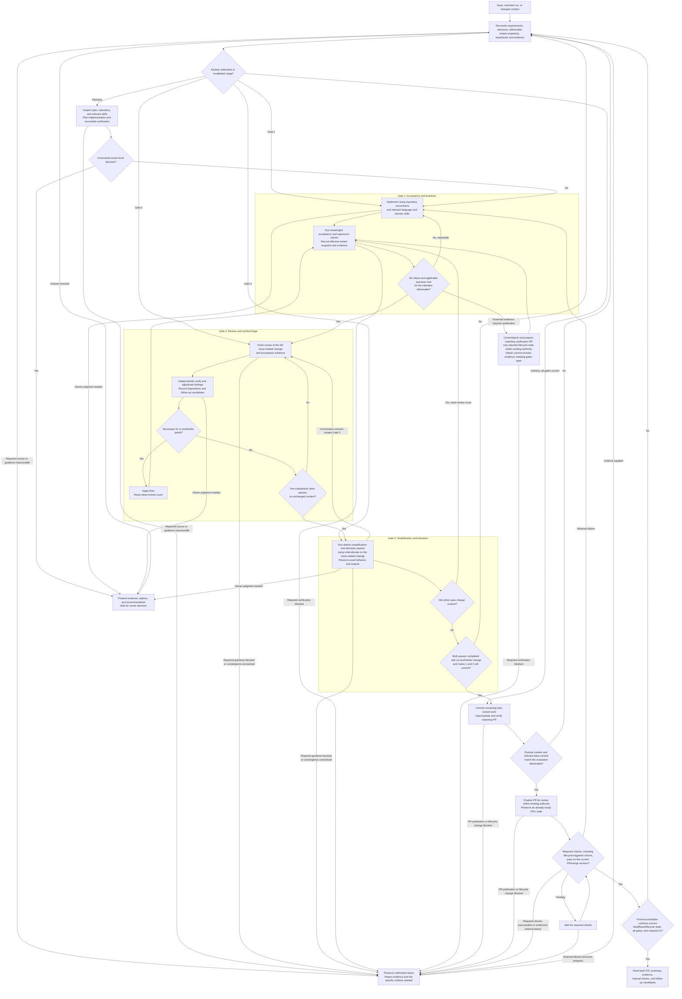

# Make It So workflow

Follow this graph using the pass conditions in [SKILL.md](../SKILL.md). It is a process specification, not an executable state-machine runtime. Every arrow is a control transition; recording findings and follow-up candidates is a side effect, never a route around the gates.

The run record carries immutable revision identities, criterion/evidence mapping, decisions, review count, findings, and follow-up candidates across transitions. On reconciliation, retain evidence only when it still applies to the actual deliverable; resume the recorded next action when no stage was invalidated.

Any task-content edit or material requirements/contract/owner-decision change resets the clean-review count, invalidates Gate 3, and renews affected Gate 1 evidence before review. Relevant base/context changes have the same effect. This includes edits made during cleanup, by commit hooks, or after CI failures. A cleanup inspection never counts as a Gate 2 review. Missing, failed, or blocked evidence never becomes a pass. Diagnose repeated cycles; if they cannot be resolved autonomously, report the specific blocker with gates incomplete.
