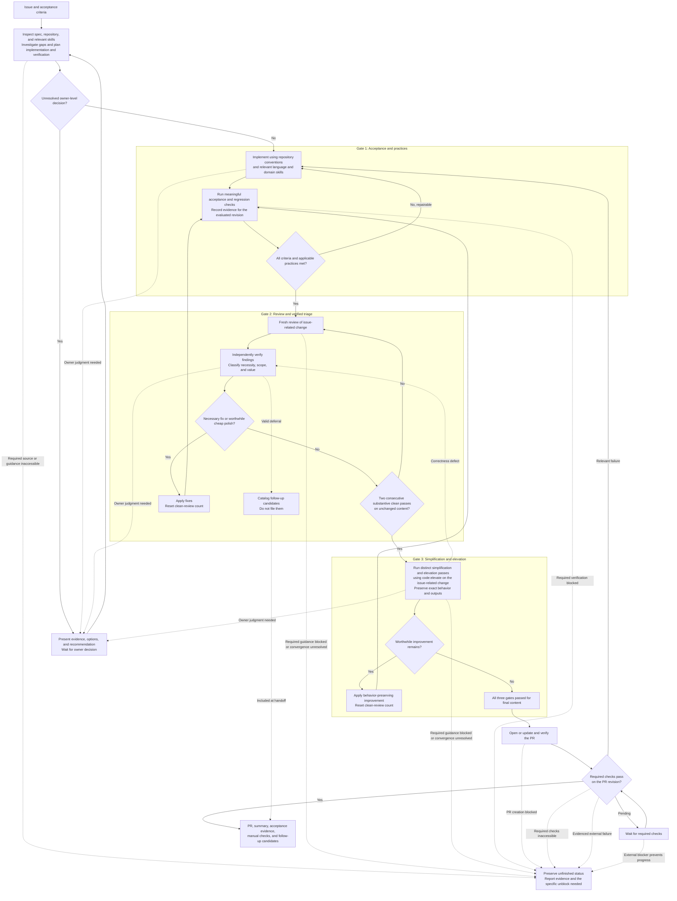

# Issue-to-PR workflow

The agent follows this graph using the pass conditions in [SKILL.md](../SKILL.md). It is a process specification, not an executable state-machine runtime.

Any task-content edit or material change to requirements, adopted contracts, or owner decisions invalidates affected evidence and resets the clean-review count. This includes later PR/CI fixes. An owner decision returns to the earliest affected gate. A failed or blocked node never silently becomes a pass. Repeated cycles without progress require diagnosis and, when unresolved, an explicit blocker rather than a false completion.
